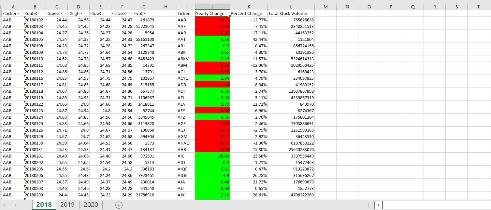
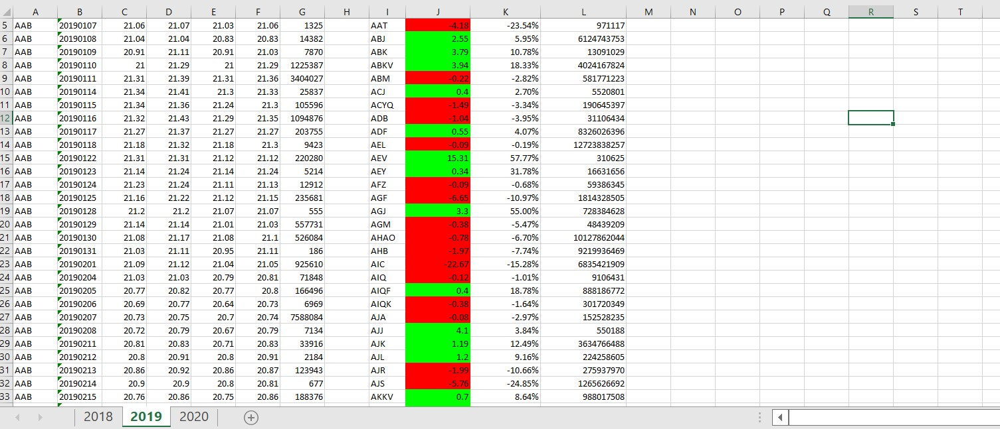
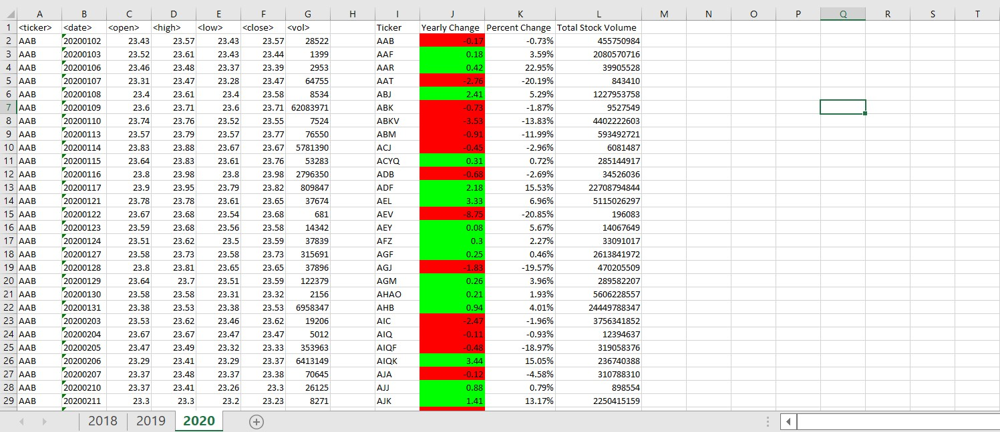

# VBA Challenge - Stock Market Data Analysis

## Overview

Welcome to the VBA Challenge repository! In this project, I have successfully completed the stock market data analysis challenge using VBA scripting in Microsoft Excel. Below, I'll explain what I've achieved and provide a summary of the project.

## Project Details

### Background

In this homework assignment, I used VBA scripting to analyze generated stock market data. The goal was to calculate various metrics for a year's worth of stock data, including the ticker symbol, yearly change, percentage change, and total stock volume. The challenge also included finding stocks with the greatest percentage increase, greatest percentage decrease, and greatest total volume.

### Achievements

Here's what I've achieved in this project:

1. **Data Analysis Script**: I created a VBA script that effectively loops through all the stocks for one year, extracting and calculating the required information, including the ticker symbol, yearly change, percentage change, and total stock volume.

2. **Conditional Formatting**: I implemented conditional formatting to highlight positive changes in green and negative changes in red, making the data more visually understandable.

3. **Stock Metrics**: My script accurately calculates the yearly change and percentage change from the opening price to the closing price at the end of the year, as well as the total stock volume.

4. **Stock Analysis**: I added functionality to my script to return the stocks with the "Greatest % Increase," "Greatest % Decrease," and "Greatest Total Volume," as specified in the challenge.

5. **Dynamic Worksheet Handling**: I made the necessary adjustments to the VBA script to enable it to run on every worksheet (representing each year) at once, making it efficient for analyzing multiple years of data.

## Screenshots

Below, you can see screenshots of a part of the final result for each year:

- **Year 2018**
  
  

- **Year 2019**
  
  

- **Year 2020**
  
  
